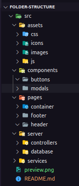

# folder-structure

> Definindo Estrutura de Pastas

Projeto construído para padronizar diretórios no desenvolvimento web.

[Clique aqui para acessar.](https://www.github.com/wsawebmaster)

## Apoio

- assets
  - css
  - icons
  - images
  - js
- components
  - buttons
  - modals
- pages
  - container
  - footer
  - header
- server
  - controllers (crud)
  - database
- services (api)

## Contato

@wsawebmaster@yahoo.com.br
@arthurssilvarp@gmail.com
@foxplayer322@gmail.com